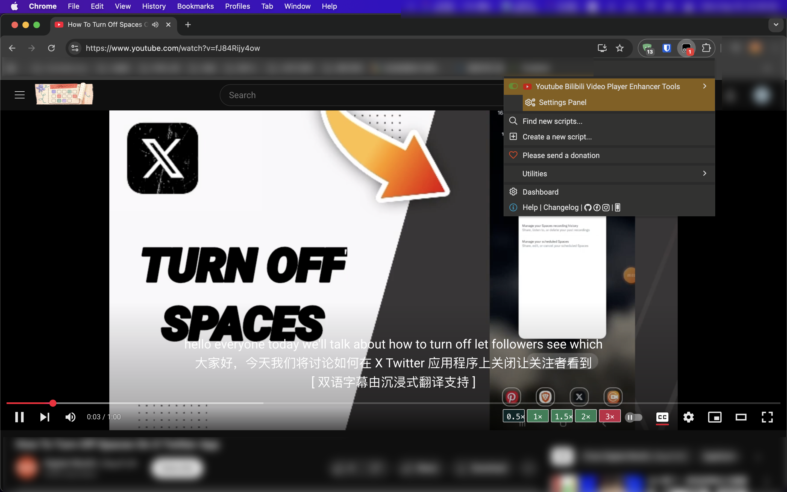
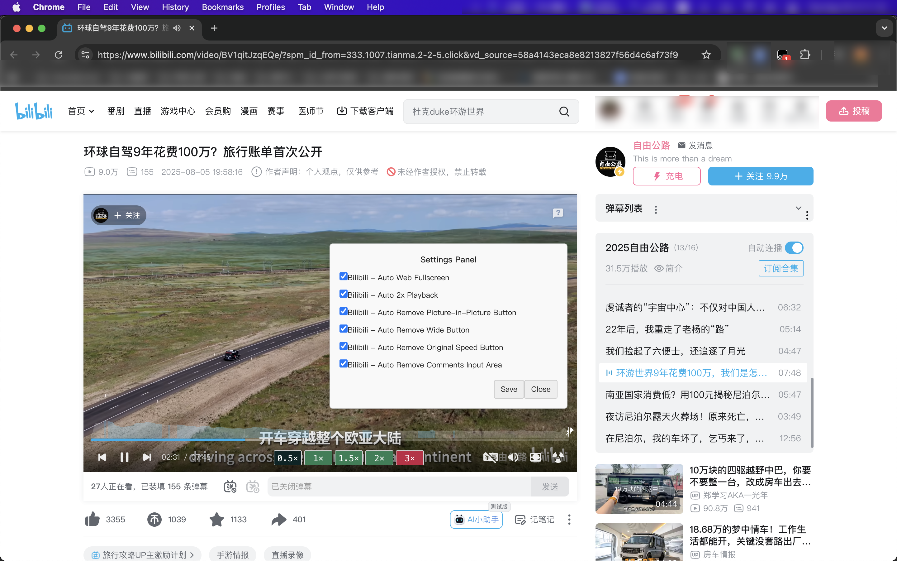

[中文](README.md) | [English](#)

# Youtube Bilibili Video Player Enhancer Tools
## Core Features Overview:
"Video PowerTools" is a powerful video enhancement userscript designed to significantly improve your viewing experience on both YouTube and Bilibili. By automating and personalizing settings, it helps you eliminate repetitive tasks and focus more on enjoying the video content.

## Key Highlights:
1. Automated Playback Settings:

* Auto Theater Mode: Say goodbye to manual clicks. The script automatically switches the player to theater mode after the video loads, providing a more immersive viewing experience.

* Auto Playback Speed: Supports setting a default playback speed (e.g., 2x) automatically when a video starts, saving you valuable time.

2. Interface Simplification & Optimization:

* Remove Redundant Buttons: You have the option to remove rarely used or unnecessary buttons, such as:

 * YouTube: Remove the Miniplayer button.

 * Bilibili: Remove the Picture-in-Picture, Wide Screen, and original speed buttons.

* Hide Comments Section: Automatically hides the comments input area on Bilibili videos, giving you a cleaner, distraction-free interface.

3. User-Friendly & Customizable:

* Settings Panel: The script includes a simple built-in settings panel, where all features can be easily enabled or disabled with a checkbox. No need to edit the code to customize your experience.

* Multi-Language Support: With support for both Chinese and English interfaces, the script is convenient for a global audience.

## Why Choose This Script?
* Dual-Platform Compatibility: One script handles both YouTube and Bilibili, eliminating the need to install multiple single-purpose scripts.

* Efficient and Convenient: Automation saves you the time of repeated manual clicks, making your viewing process smoother.

* Clean Interface: By removing unnecessary elements, the script makes your video page clean and tidy.

* Continual Updates: The script's maintainer is committed to continuous updates to adapt to website changes, ensuring long-term functionality.

Install "Youtube Bilibili Video Player Enhancer Tools" now to begin your enhanced video viewing journey!

## Update
V1.0.0

## 🚀 Quick Start

Install as a userscript here: [here](https://greasyfork.org/zh-CN/scripts/546313-youtube-bilibili-video-player-enhancer-tools)

You will need a userscript manager like [Tampermonkey](https://chrome.google.com/webstore/detail/tampermonkey/dhdgffkkebhmkfjojejmpbldmpobfkfo) or [Greasemonkey](https://addons.mozilla.org/nl/firefox/addon/greasemonkey/)

### Donate 👍
This project is maintained by an individual. If you find the script helpful, please scan the QR code on WeChat to donate. Thank you for your support!

## Contact Me
julong[at]111.com