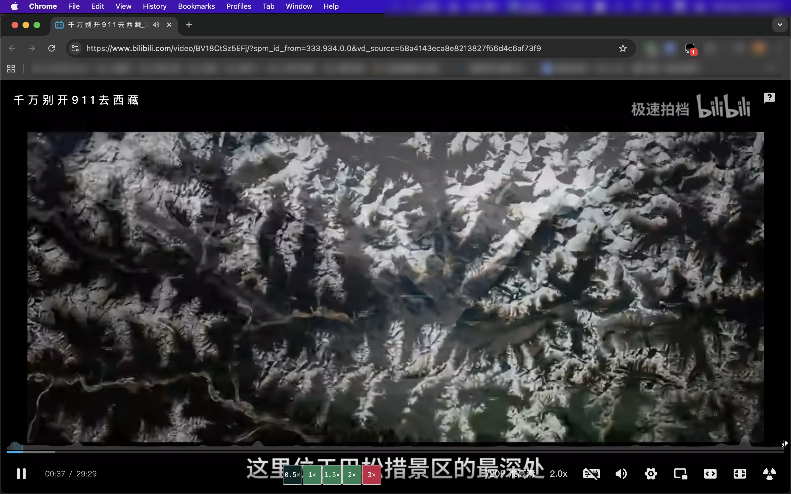
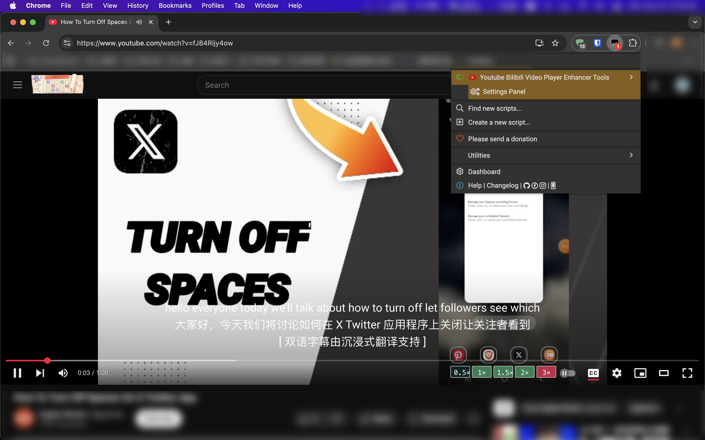
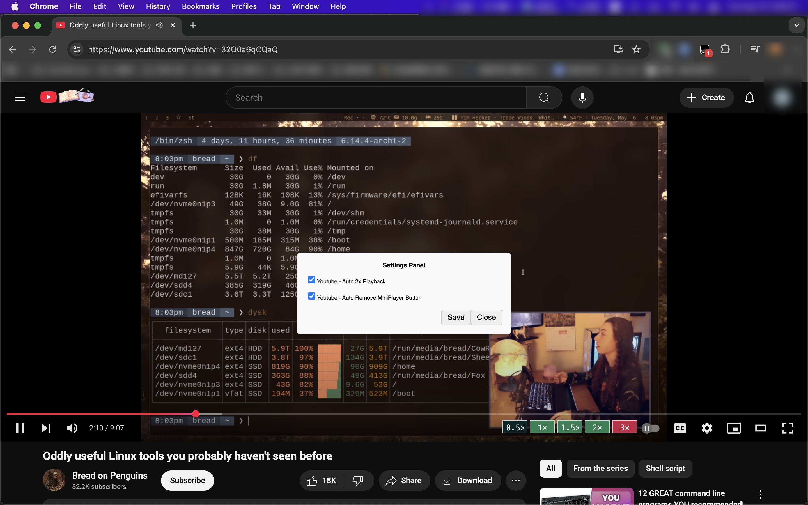
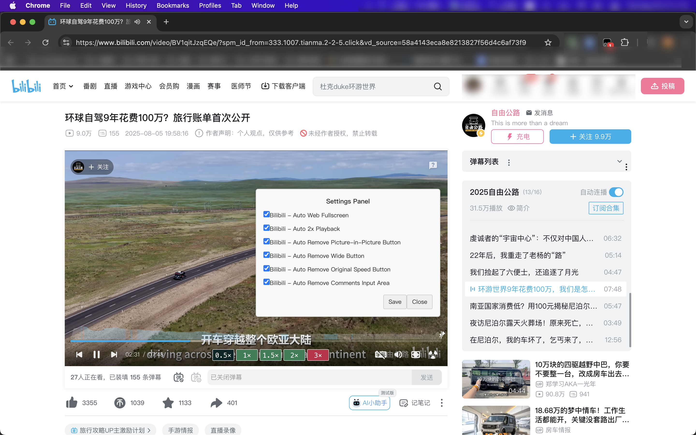

[中文](#) | [English](README-en.md)

# 油管哔哩哔哩视频播放器增强工具
## 核心功能概述:
「油管哔哩哔哩视频播放器增强工具」是一款专为油猴用户设计的强大视频增强脚本，旨在显著提升您在 YouTube 和 Bilibili 上的观看体验。它通过自动化、个性化的设置，帮助您摆脱重复操作，让您更专注于享受视频内容。

## 功能亮点:
1. 自动化播放设置:
* 自动网页全屏: 告别手动点击，脚本能在视频加载后自动将播放器切换至网页全屏模式，为您提供更沉浸式的观看体验。

* 自动倍速播放: 支持自定义默认倍速（如 2 倍速），在视频开始时自动为您设置，节省您的宝贵时间。

2. 界面精简与优化:

* 移除冗余按钮: 您可以选择移除不常用或不需要的按钮，例如：
  * YouTube: 移除迷你播放器（Miniplayer）按钮。
  * Bilibili: 移除画中画、宽屏、原始倍速等按钮。

* 隐藏评论区: 自动移除 Bilibili 视频下方的评论输入区，为您提供更简洁、无干扰的界面。

3. 用户友好与个性化:

* 设置面板: 脚本内置简洁的设置面板，所有功能都可通过勾选轻松开启或关闭，无需修改代码，即可随心定制。

* 多语言支持: 支持中文和英文界面，方便全球用户使用。

## 为什么选择此脚本？
* 双平台兼容: 一款脚本同时搞定 YouTube 和 Bilibili，无需安装多个功能单一的脚本。

* 高效便捷: 自动化功能为您节省了每次手动点击的时间，让您的观看流程更加流畅。

* 界面清爽: 移除不必要的元素，让您的视频页面更加干净整洁。

* 持续更新: 脚本维护者承诺持续更新，以适应网站的改版，确保功能的长期可用性。

立即安装「油管哔哩哔哩视频播放器增强工具」，开启您的全新视频观看旅程！

## Update
    V1.0.0

## 🚀 快速开始

在此处安装脚本: [https://greasyfork.org/zh-CN/scripts/544981-youtube-more-speeds-modfied](https://greasyfork.org/zh-CN/scripts/544981-youtube-more-speeds-modfied)

你可以使用用户脚本管理器如[Tampermonkey](https://chrome.google.com/webstore/detail/tampermonkey/dhdgffkkebhmkfjojejmpbldmpobfkfo) or [Greasemonkey](https://addons.mozilla.org/nl/firefox/addon/greasemonkey/)

### 打赏支持 👍
本项目由个人维护。如果你觉得脚本对你有帮助，欢迎使用微信扫码打赏。感谢你的支持！

## 联系我
   julong[at]111.com