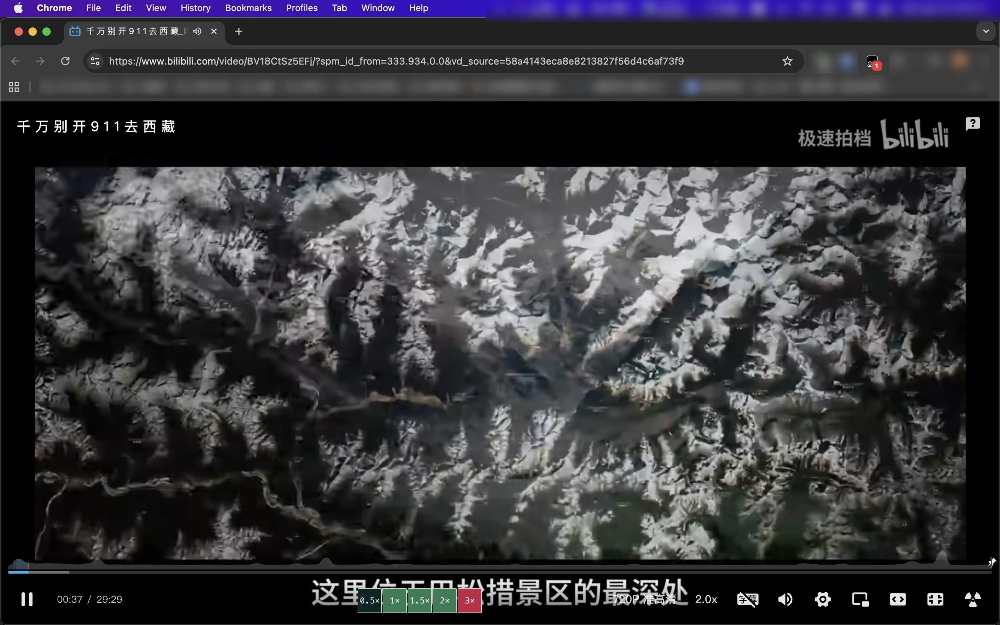
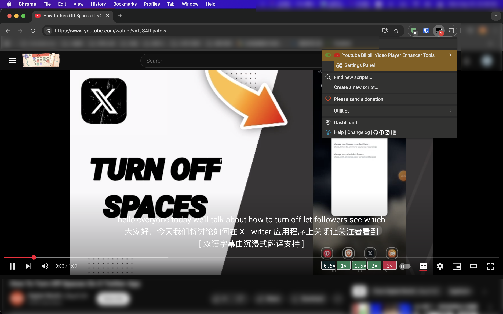
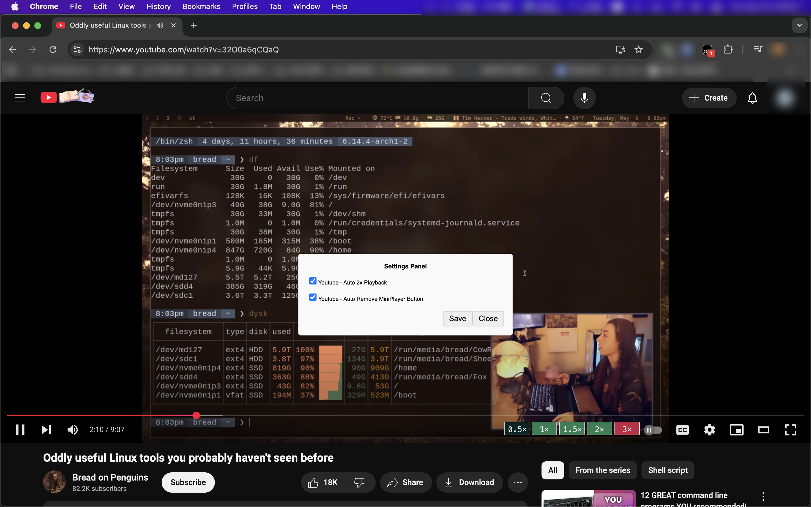
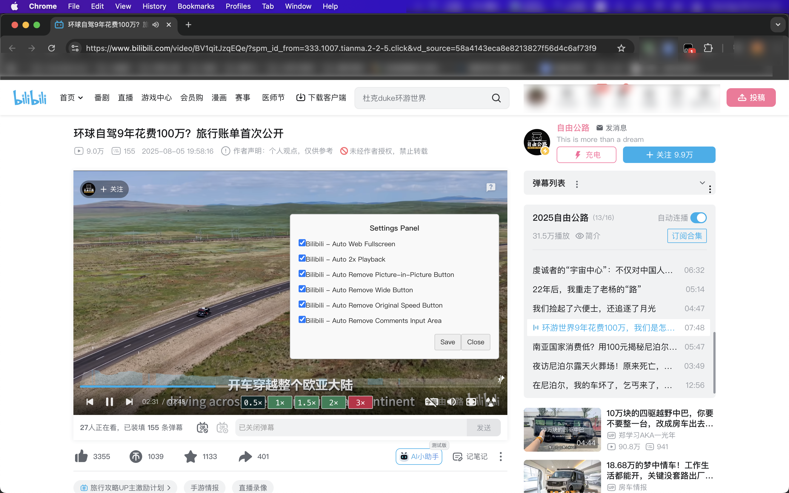

[中文](#) | [English](README-en.md)

### 🚀 快速开始

在此处安装脚本: [here](https://greasyfork.org/zh-CN/scripts/546313-youtube-bilibili-video-player-enhancer-tools)

你可以使用用户脚本管理器如[Tampermonkey](https://chrome.google.com/webstore/detail/tampermonkey/dhdgffkkebhmkfjojejmpbldmpobfkfo) or [Greasemonkey](https://addons.mozilla.org/nl/firefox/addon/greasemonkey/)

### 更新日志
本项目的所有显著变更都将记录在此文件中。感谢每一位用户的支持和建议！

#### [1.4] [功能调整与新增]
* **移除YouTube按钮设置项**: 移除YouTube MiniPlayer按钮的设置
* **新增Youtube按钮设置项**: 新增YouTube自动播放开关、字幕按钮、设置按钮的设置项目

#### [1.3] [功能增强与优化]
* **新增直播检测功能**: YouTube直播时自动将播放速度设为1.0倍速
* **增强速度指示器**: 全屏模式下显示当前播放速度
* **改进快捷键支持**: 优化逗号`,`和句号`.`键的调速逻辑
* **界面优化**: 倍速按钮添加高亮显示，提升用户体验
* **稳定性改进**: 修复页面切换时的定时器清理问题

#### [1.2] [功能优化] - 最大快捷播放速度显著提升至**4倍**
* 扩展快捷键支持的倍速范围至4.0倍
* 优化快捷键调速算法，提供更流畅的调速体验
* 使用户能够更快、更高效地浏览或查看内容

#### [1.0.8] [功能优化] - 新增**2.5倍**播放速度选项
* 在2倍和3倍速度之间提供更精细的控制
* 优化倍速按钮颜色编码系统
* 改进设置面板的用户界面

#### [1.0.0] [初始发布] - 核心版本正式发布
* 基础倍速控制功能（0.5x, 1.0x, 1.5x, 2.0x, 3.0x）
* YouTube和Bilibili双平台支持
* 可视化设置面板
* 多语言界面支持（中文/英文）
* 快捷键调速功能

### 打赏支持 👍
本项目由个人维护。如果你觉得脚本对你有帮助，欢迎使用微信扫码打赏。感谢你的支持！

### 联系我
   julong[at]111.com

# 油管哔哩哔哩视频播放器增强工具

## 核心功能概述:
「油管哔哩哔哩视频播放器增强工具」是一款专为油猴用户设计的强大视频增强脚本，旨在显著提升您在 YouTube 和 Bilibili 上的观看体验。它通过自动化、个性化的设置，帮助您摆脱重复操作，让您更专注于享受视频内容。

## 🎯 核心功能亮点:

### 1. 高级倍速控制
* **扩展倍速选项**: 界面添加更多倍速按钮（0.5x, 1.0x, 1.5x, 2.0x, 2.5x, 3.0x）
* **智能快捷键**: 使用逗号`,`键减速，句号`.`键加速，支持最高4x倍速（快捷键）
* **速度指示器**: 调速时在全屏/网页全屏模式下显示当前速度
* **自动倍速播放**: 支持自定义默认倍速（如2倍速），视频开始时自动设置

### 2. 智能直播检测 (YouTube专属)
* **直播识别**: 自动检测YouTube直播流
* **智能调速**: 直播时自动将播放速度设为1.0倍速，确保正常观看体验
* **状态切换**: 直播结束后恢复用户设置的倍速

### 3. 界面精简与优化

#### 功能设置:
* **按钮高亮显示**: 当前选中的倍速按钮有醒目边框提示
* **移除不常用的播放器按钮**: ，提供更专注的观看环境
* **自动网页全屏**: 视频加载后自动进入网页全屏模式
* **移除冗余按钮**: 可选择移除不常用的画中画、宽屏、原始倍速、设置等按钮
* **隐藏评论区**: 自动移除评论输入区，提供更简洁界面

### 4. 用户友好与个性化
* **可视化设置面板**: 所有功能可通过勾选框轻松启用/禁用
* **多语言支持**: 自动识别浏览器语言，支持中文和英文界面
* **配置保存**: 所有设置自动保存，下次访问无需重新配置

## 📋 功能对比表

| 功能 | YouTube | Bilibili |
|------|---------|----------|
| 扩展倍速按钮 | ✅ | ✅ |
| 快捷键调速 | ✅ | ✅ |
| 速度指示器 | ✅ | ✅ |
| 自动倍速播放 | ✅ | ✅ |
| 直播检测 | ✅ | ❌ |
| 自动网页全屏 | ❌ | ✅ |
| 移除冗余按钮 | ✅ | ✅ |
| 隐藏评论区 | ❌ | ✅ |

## ⚙️ 详细配置选项

### YouTube 设置:
- [ ] 自动倍速播放（可自定义默认速度）
- [ ] 自动播放开关
- [ ] 自动移除字幕按钮
- [ ] 自动移除设置按钮

### Bilibili 设置:
- [ ] 自动网页全屏
- [ ] 自动倍速播放（可自定义默认速度）
- [ ] 自动移除画中画按钮
- [ ] 自动移除宽屏按钮
- [ ] 自动移除原始倍速按钮
- [ ] 自动移除评论输入区
- [ ] 自动移除设置按钮

## 🚀 为什么选择此脚本？
* **双平台兼容**: 一款脚本同时搞定 YouTube 和 Bilibili，无需安装多个单功能脚本
* **高效便捷**: 自动化功能节省重复操作时间，观看流程更流畅
* **界面清爽**: 移除不必要元素，视频页面干净整洁
* **智能贴心**: 直播检测、速度提示等细节优化
* **持续更新**: 脚本为维护者长期自用，如有失效会第一时间更新。具备长期可用性

立即安装「油管哔哩哔哩视频播放器增强工具」，开启您的全新视频观看旅程！

